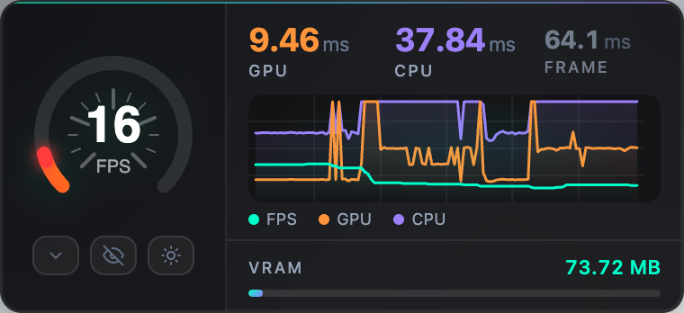
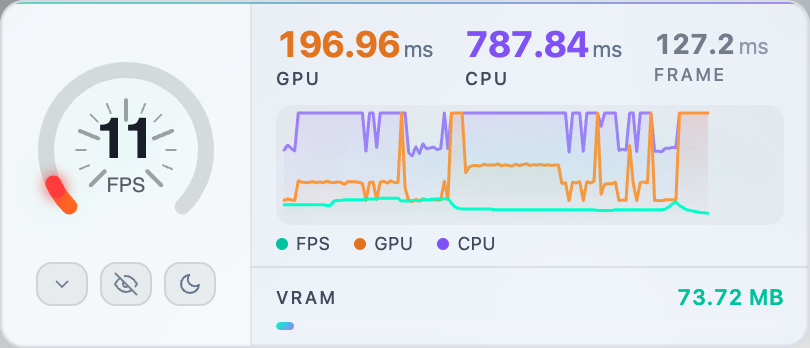
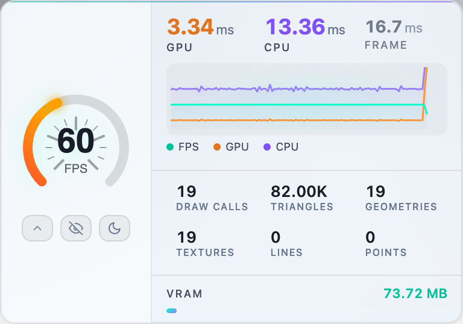

# r3f-webgpu-perf

[](https://www.npmjs.com/package/r3f-webgpu-perf)
[](https://github.com/ektogamat/r3f-webgpu-perf/blob/main/LICENSE)

<p align="center">
  <br />
  <br />
  
</p>

Easily monitor the performance of your [@react-three/fiber](https://github.com/pmndrs/react-three-fiber) application — built for **React Three Fiber 8+** and designed to work with both **WebGPU** and **WebGL** renderers (including WebGPU setups where `gl.info` may be unavailable).

Inspired by [r3f-perf](https://github.com/utsuboco/r3f-perf).

| Add `<Perf />` inside your Canvas | [Live demo](https://r3f-webgpu-perf.vercel.app) |
| --------------------------------- | ----------------------------------------------- |

## Features

- **WebGPU & WebGL** — drop `<Perf />` into any R3F `Canvas`; stats are collected from `gl.info` on WebGL or via scene traversal on WebGPU.
- **Light & dark mode** — toggle the theme with the sun/moon button so the panel stays readable over bright or dark scenes.
- **Compact or expanded** — click the chevron to expand the panel and reveal scene breakdown: draw calls, triangles, geometries, textures, lines, and points.
- **Minimize to a dot** — hide the full panel with the eye button; it collapses to a small dot in the corner so it does not obstruct the viewport. Click the dot to bring it back.
- **FPS gauge, live graph & VRAM** — circular gauge (cycles FPS → GPU → CPU), real-time graph, and optional VRAM estimate bar.

## Installation

```bash
npm i r3f-webgpu-perf
```

Peer dependencies (already present in most R3F projects):

- `react` >= 18
- `react-dom` >= 18
- `@react-three/fiber` >= 8
- `three` >= 0.150

## Usage

Add `<Perf />` anywhere inside your `<Canvas>`:

```jsx
import { Canvas } from "@react-three/fiber";
import { Perf } from "r3f-webgpu-perf";

function App() {
  return (
    <Canvas>
      <Perf position="top-left" />
      {/* your scene */}
    </Canvas>
  );
}
```

## Options

| Prop            | Default      | Description                                                            |
| --------------- | ------------ | ---------------------------------------------------------------------- |
| `position`      | `'top-left'` | Panel position: `top-left`, `top-right`, `bottom-left`, `bottom-right` |
| `showGraph`     | `true`       | Show real-time FPS/GPU/CPU graph                                       |
| `showGauge`     | `true`       | Show circular gauge (click to cycle FPS → GPU → CPU)                   |
| `minimal`       | `false`      | Condensed view with essential metrics only                             |
| `showVRAM`      | `false`      | Show estimated VRAM usage bar                                          |
| `logsPerSecond` | `10`         | How often scene stats refresh                                          |
| `openByDefault` | `true`       | Show panel on load (set `false` to start minimized as a dot in the corner) |
| `className`     | —            | Custom CSS class on the portal wrapper                                 |
| `style`         | —            | Inline styles on the portal wrapper                                    |

## Advanced: headless mode

Use `PerfHeadless` to collect metrics without the built-in UI, and read values with `usePerf`:

```jsx
import { Canvas } from "@react-three/fiber";
import { PerfHeadless, usePerf } from "r3f-webgpu-perf";

function PerfLogger() {
  const fps = usePerf((s) => s.fps);
  console.log("FPS:", fps);
  return <PerfHeadless logsPerSecond={10} />;
}

function App() {
  return (
    <Canvas>
      <PerfLogger />
    </Canvas>
  );
}
```

You can also build a custom UI with `PerfPanel` and wire it yourself outside the canvas if needed.

### API exports

```js
import {
  Perf,
  PerfHeadless,
  PerfPanel,
  usePerf,
  perfActions,
  getPerf,
  perfState,
} from "r3f-webgpu-perf";
```

## WebGPU vs WebGL

| Metric                                      | Source                                                                               |
| ------------------------------------------- | ------------------------------------------------------------------------------------ |
| FPS / frame time                            | Measured via `performance.now()`                                                     |
| GPU / CPU ms                                | **Estimated** (20% / 80% split of frame delta)                                       |
| Draw calls, triangles, geometries, textures | `gl.info` when available (WebGL), otherwise manual scene traversal (WebGPU fallback) |
| VRAM                                        | Estimated from geometry attributes and texture sizes                                 |

Real WebGPU timestamp queries are not implemented yet — planned for a future release.

## Development

```bash
git clone https://github.com/ektogamat/r3f-webgpu-perf.git
cd r3f-webgpu-perf
npm install
npm run dev         # WebGPU demo with hot reload (Chrome/Edge recommended)
npm run build       # build library to dist/
npm run build:demo  # build demo to demo-dist/
```

The demo uses **WebGPU + TSL post-processing** (`RenderPipeline`, `bloom`, `chromaticAberration`) with an instanced neon particle field and Low/Med/Ultra stress presets.

## Changelog

See [CHANGELOG.md](./CHANGELOG.md).

## License

MIT © [Anderson Mancini](https://github.com/ektogamat)
